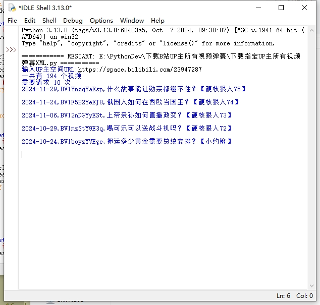

# 下载B站UP主所有视频弹幕

一.安装Python环境

开发环境:

Python:Python 3.13.0

二.下载包

```
pip install requests
```

三.得到UP主 空间URL

示例:


https://space.bilibili.com/23947287 就是目标URL

四.运行py

输入上诉的目标URL

https://space.bilibili.com/23947287

五.下载结果

